# :car: IoT Safe Mobility System

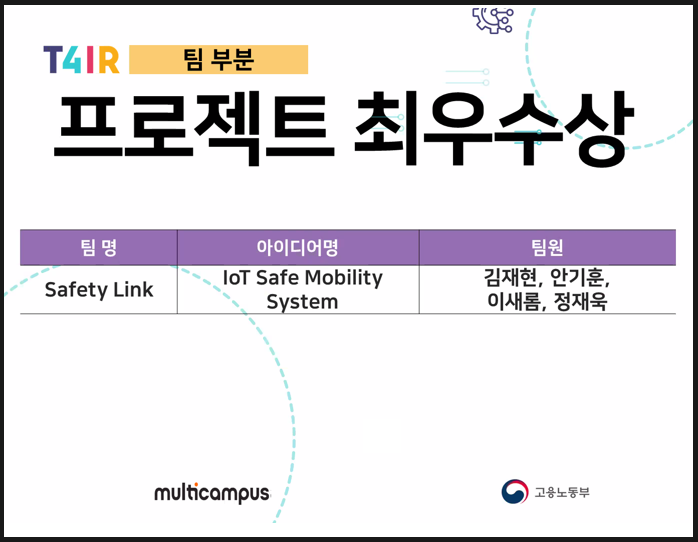

## :one: IoT Safe Mobility System이란?

- 차량 관련 안전성 제고를 목적으로 IoT와 빅데이터를 활용하여 안전 기능 및 편의 기능을 종합적으로 탑재한 소프트웨어 시스템

## :two: 팀 구성 및 핵심역할

- 김재현(팀장) : Android APP(Mobile), 영유아 고립사고 방지 기능
- 안기훈 : Android APP(Tablet),  졸음 운전 위험 알림
- 이새롬 : 센서제어, 교통사도 알림
- 정재욱 : 관리자 웹 차트, 적재물 낙하 사고 알림

## :three: 프로젝트 수행 절차 및 방법

- **서비스 구성도**

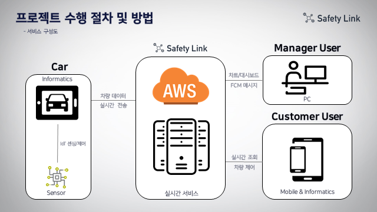

- **시스템 구성도**

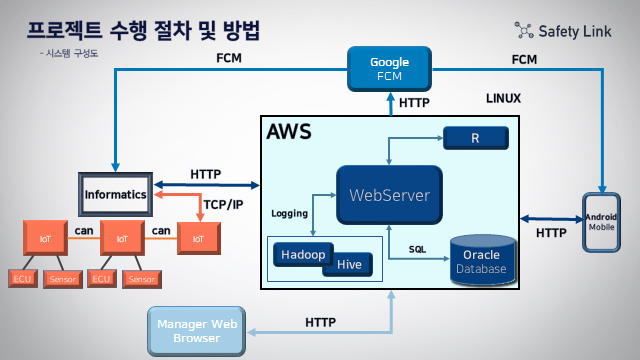

- **개발 도구**

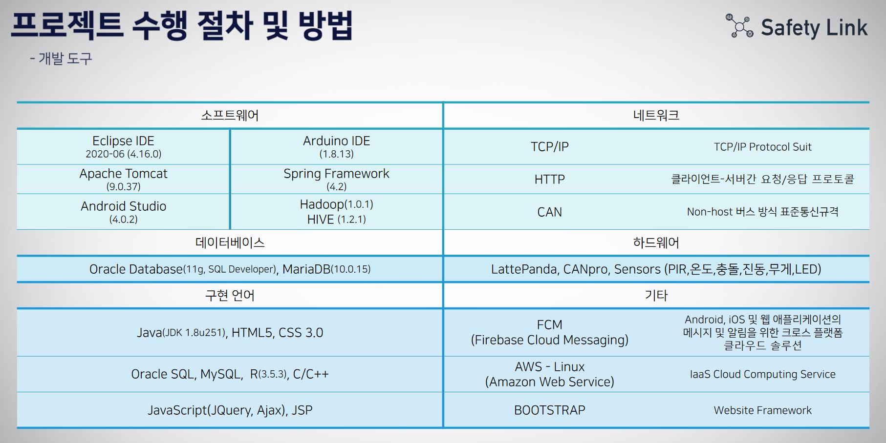

- **ERD**

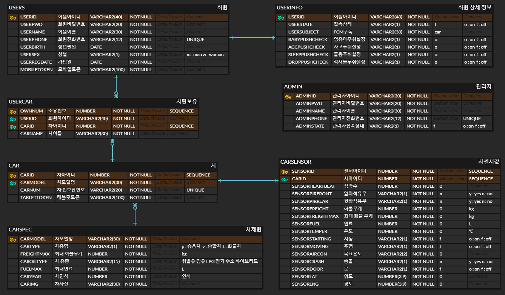

- **개발일정** (20.11.17~20.12.21, 약 1달)

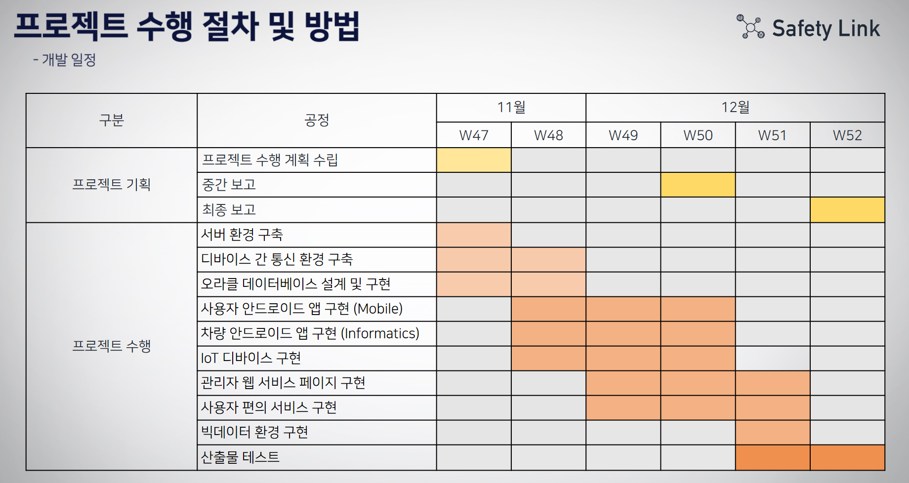

## 4️⃣ 프로젝트 수행결과

### :pushpin:사용자 핵심기능

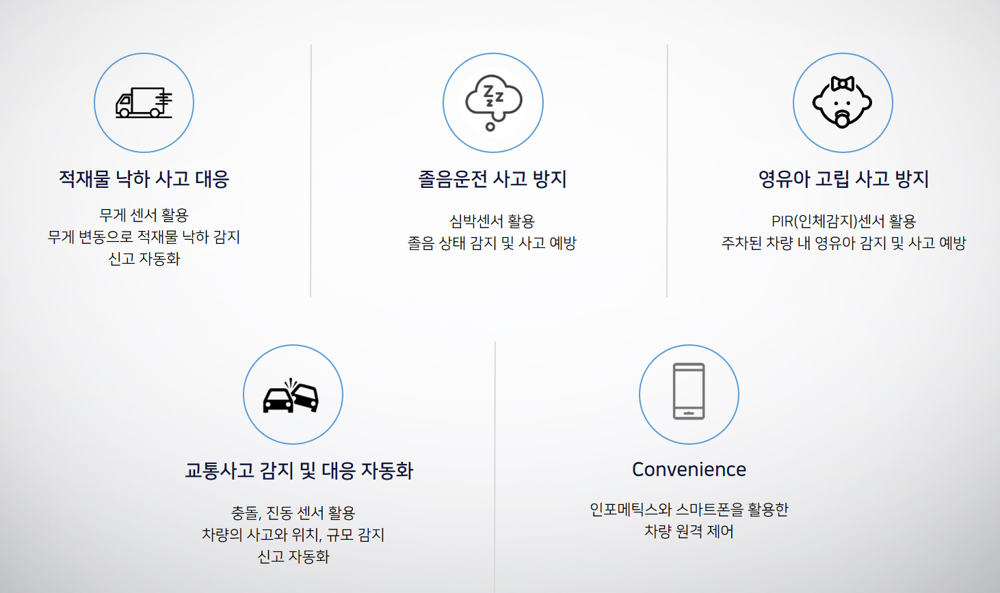

### :pushpin:관리자 핵심기능

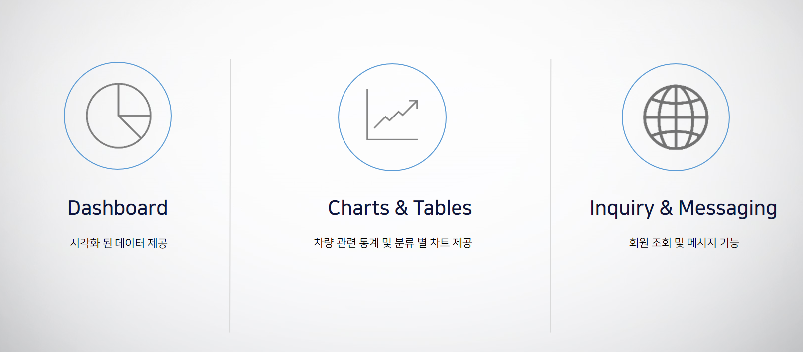

### :pushpin: 구현사진​

#### 사용자 기능

---

- 로그인 및 회원가입

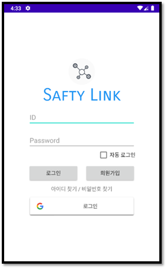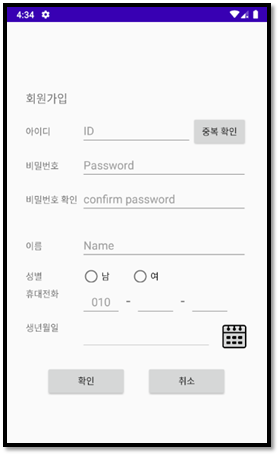

- 모바일 차량등록(모바일 :point_right:차량 인포메틱스)

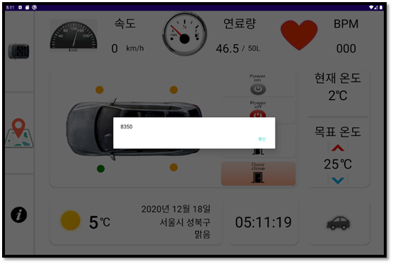

- 모바일 차량등록(모바일 인증번호 등록과 차량연동)

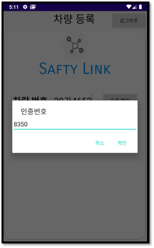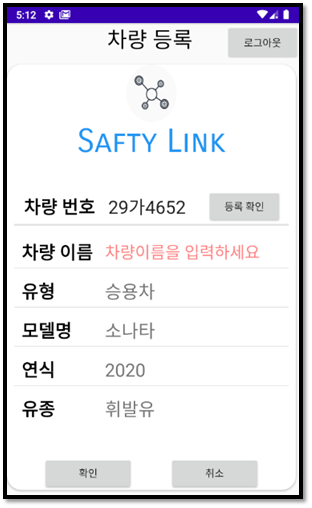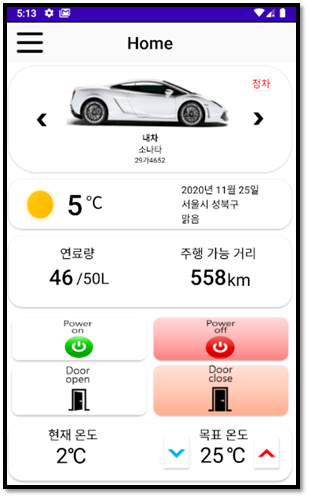

- 차량 종류 별 Home 화면
  - 차량이동, 현재날씨, 연료량 확인 가능
  - 차량의 시동, 도어, 온도 제어 가능

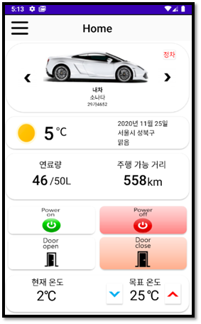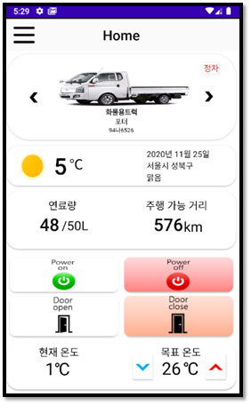

- 마이 페이지

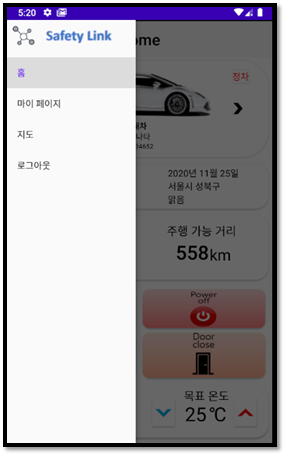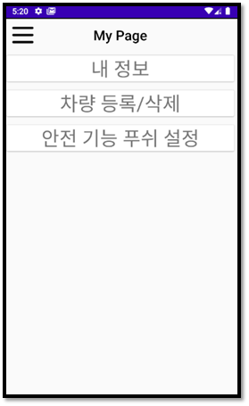

- 마이페이지 - 내 정보, 차량등록/삭제, 푸쉬설정

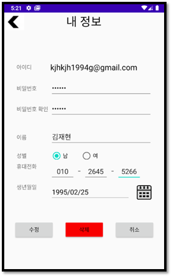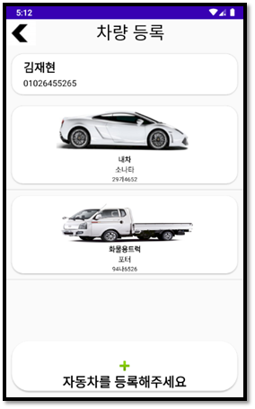
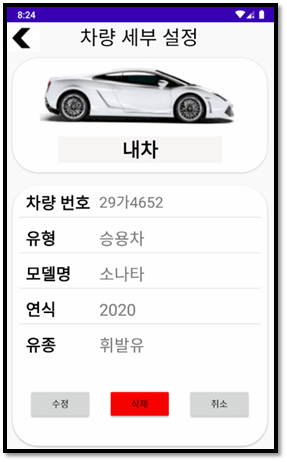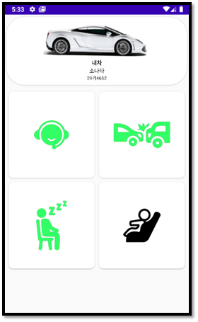

- 태블릿 인포메틱스(차량등록, 지도, 차량정보)

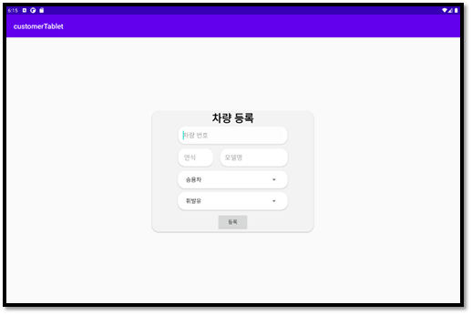

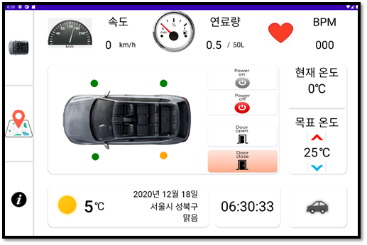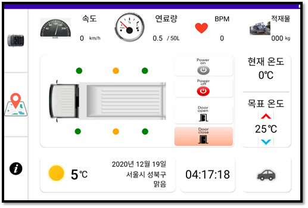

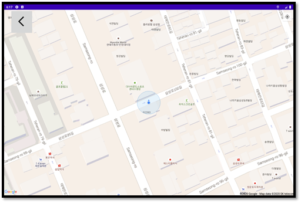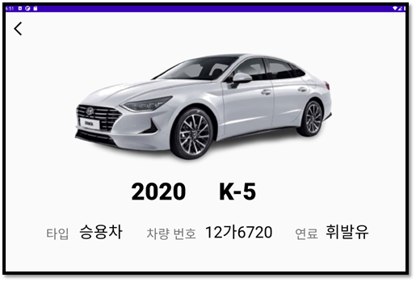

#### 관리자 기능
---

- 관리자 웹 (로그인, 대쉬보드, 차트, 유저정보 및 푸쉬)

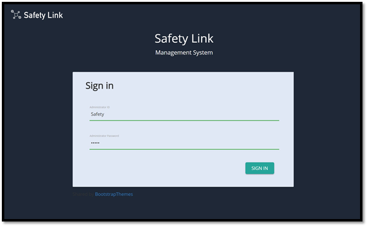

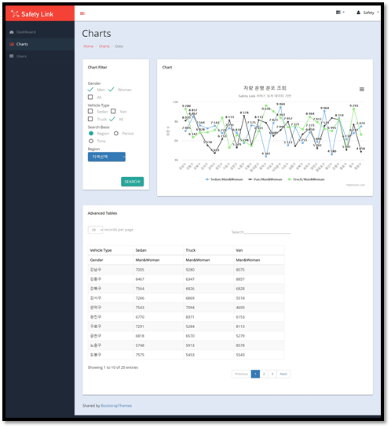

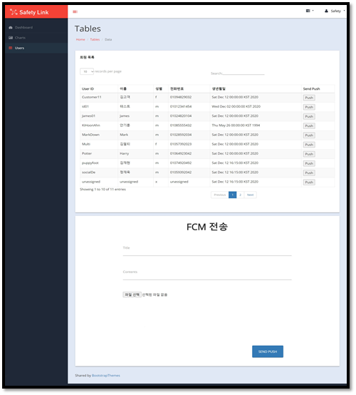

## :five: 시현영상

###  :movie_camera: ​https://youtu.be/ruTkEXwlFHY 